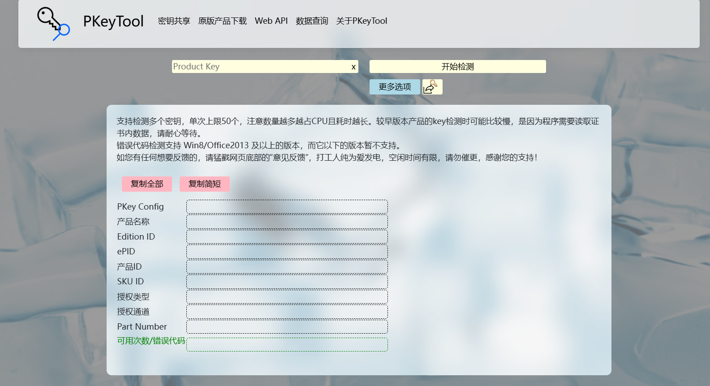
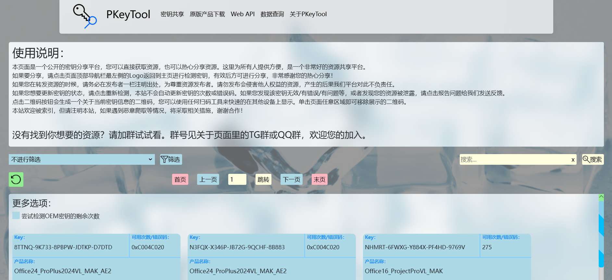

# 密钥检测/密钥分享/密钥查询 等微软产品激活相关

<b>密钥检测工具网页版：https://pkeytool.com （永久域名）  </b>
 
   
# 部署教程
在项目内找到文件夹PKeyToolWeb_NetCore，把它打包下载下来，下载完后打开解决方案，直接编译运行即可跑起来。  
<h3>提示</h3>
该项目没有配置数据库，如果有需要请自行配置数据库，按照网上.net core的数据库配置教程来即可，项目使用微软的ORM框架，即EF Core。   
项目内也有安装该框架，你需要修改配置文件内的数据库连接字符串，以及完整配置数据库实体dbcontext相关类，然后在控制器里面使用这个context即可。   
如有bug请不要犹豫立即反馈，我会做出对应改进。   

# 预览：
  
  
# 本站当前无广告，无推广，无付费 
欢迎加入我们的群激活魔盒，讨论和PKeyTool相关，和激活相关等，群聊号码：799132569

  
# 引用
**WitherOrNot**&nbsp;&nbsp;&nbsp;&nbsp;[winkeycheck](https://github.com/WitherOrNot/winkeycheck)

